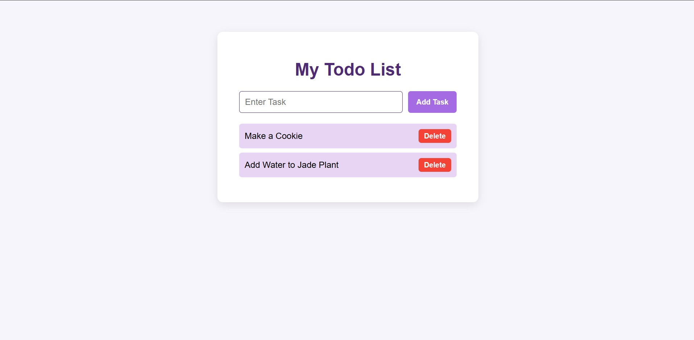

# Mini Todo List

A simple, interactive Todo List web application built with **HTML, CSS, and JavaScript**.  
Users can **add tasks, delete tasks, and enjoy smooth animations** for a modern look and feel.

---

## **Features**

- Add new tasks using an input box and button.
- Delete tasks individually with a delete button.
- Smooth **fade-in animation** when adding tasks.
- **Slide-out animation** when deleting tasks.
- Buttons have hover effects with scale animation.
- Responsive and modern design using CSS.

---

## **Demo Screenshot**

 

---

## **Technologies Used**

- HTML5
- CSS3 (with animations and transitions)
- JavaScript (DOM manipulation)

